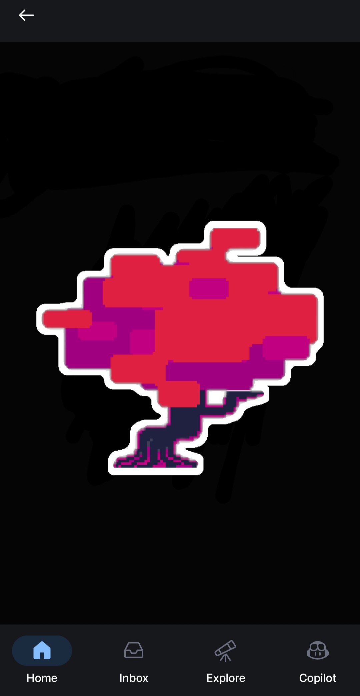

# Egg-Achievement-Tutorial
How to get Github's secret "Egg" achievement!

# Some things about this achievement
This achievement isn't visible on other people's accounts until you get it, so it's definitely meant to be discovered accidentally or something.
This achievement is only possible to get on the Github mobile app. Sorry PC bros!

# How To Get It
First, open the Github mobile app and create a private repository named "Egg" (Capitals matter!) and add a Readme. This is a very important step, so follow my words carefully. Edit the Readme and make it say "egg" exactly 6 times. Nothing else in the Readme at all. Commit your changes. Then, close and open the repo page multiple times. I believe it is a 1 in 66 chance for some reason. You might be here for a while.

After you hit the insane chance, you will be put in this page with music (Genuinely I think that it should be put somewhere we can listen to it. Maybe I'll upload it here later. If I did, "Yes" will be here: No)

You have to tap on the tree. Once you do, you will have some text appear like dialogue. Here's all the text.

> Well, there is an octopus here.
> They seem glad to meet you.
> They say they have not met anyone in a long time.
> They offer you a gift.

There is a choice here. If you choose yes it says:

> You got the "Egg" achievement. 

If you choose no, it says:

> They seem disappointed. 
> If you change your mind, you can come back any time.
> Whether 11 hours or 11 years, they will be waiting.

After either interaction if you tap on the tree again, it will say:

> Well, there isn't an octopus here.

All you have to do is say yes, and you will get it. 

# Thanks for reading!
I hope this tutorial helped you.